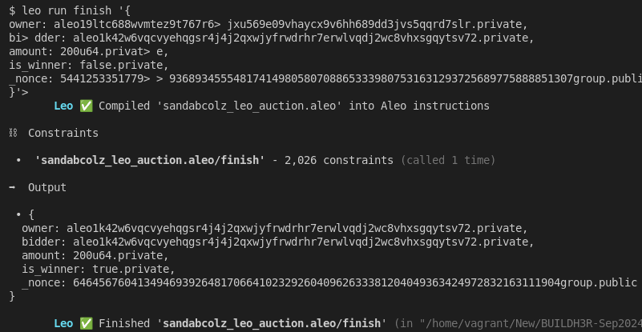

# BUILDH3R Sept Leo

## System Setup
-  Install `rust` locally. Below command will install cli. [More deatils](https://www.rust-lang.org/tools/install)
    ```sh
    curl --proto '=https' --tlsv1.2 -sSf https://sh.rustup.rs | sh
    ```

- Install `leo`. [More Details](https://github.com/ProvableHQ/leo/):
    ```sh
    # Download the source code
    git clone https://github.com/ProvableHQ/leo/
    cd leo
    git checkout testnet-beta
    cargo install --path .
    ```

- Install `SnarkOS`. [More Details](https://github.com/ProvableHQ/snarkOS):
    ```sh
    git clone https://github.com/AleoHQ/snarkOS.git --depth 1
    cd snarkOS
    git checkout testnet-beta
    ./build_ubuntu.sh
    cargo install --path .
    ```

- Install SnarkVM. [More Details](https://github.com/ProvableHQ/snarkVM):
    ```sh
    cargo install snarkvm
    ```

- Make sure all the binaries are added in PATH.

## Create Aleo Project
### Create new project:
- Command:
    ```sh
    leo new sandabcolz_leo_auction
    ```

- Since, we are trying to create an auction app, there must be bidder and owner. So let's create 2 bidder account and 1 owner.
- Command:
    ```sh
    snarkos account new
    ```
- So, run above command 3 times in terminal:
    <details><summary> Detailed Output </summary><blockquote>

    ~~~
    $ snarkos account new

    Private Key  <redacted>
        View Key  <redacted>
        Address  aleo19ltc688wvmtez9t767r6jxu569e09vhaycx9v6hh689dd3jvs5qqrd7slr

    $ snarkos account new

    Private Key  <redacted>
        View Key  <redacted>
        Address  aleo1k42w6vqcvyehqgsr4j4j2qxwjyfrwdrhr7erwlvqdj2wc8vhxsgqytsv72

    $ snarkos account new

    Private Key  <redacted>
        View Key  <redacted>
        Address  aleo120necdjm8dmuws027h6hunzp57j9flde00cnlf5zzps558rnugxs3uzxyv
    ~~~
    
    </blockquote></details>

- In above image, suppose 1 a/c with Address `aleo19ltc688wvmtez9t767r6jxu569e09vhaycx9v6hh689dd3jvs5qqrd7slr` is owner and remaining 2nd and 3rd a/cs are bidders. 

- Modify `auction/src/main.leo`. Do not forget to replace owner address in `main.leo` file.

- `.env` is created during the creation of the project. By default, it contains:
    ```sh
    NETWORK=testnet
    PRIVATE_KEY=APrivateKey1zkp8CZNn3yeCseEtxuVPbDCwSyhGW6yZKUYKfgXmcpoGPWH
    ENDPOINT=https://api.explorer.aleo.org/v1
    ```

- Value of Endpoint must be changed with: `https://api.explorer.provable.com/v1`
- New `.env`:
    ```sh
    NETWORK=testnet
    PRIVATE_KEY=APrivateKey1zkp8CZNn3yeCseEtxuVPbDCwSyhGW6yZKUYKfgXmcpoGPWH
    ENDPOINT=https://api.explorer.provable.com/v1
    ```

### Run Test
#### 1st Bid:
- Now, the value of `PRIVATE_KEY` in `.env` must be replaced with the `PRIVATE_KEY` of the 1st bidder.
- Run `place_bid` transaction:
    - Code Snippet:
        ```sh
        leo run place_bid <Address> <Amount>
        ```
    
    - Command:
        ```sh
        leo run place_bid aleo1k42w6vqcvyehqgsr4j4j2qxwjyfrwdrhr7erwlvqdj2wc8vhxsgqytsv72 200u64
        ```
        <details><summary> Detailed Output </summary><blockquote>

        ~~~
        $ leo run place_bid aleo1k42w6vqcvyehqgsr4j4j2qxwjyfrwdrhr7erwlvqdj2wc8vhxsgqytsv72 200u64
            Leo ✅ Compiled 'sandabcolz_leo_auction.aleo' into Aleo instructions

        ⛓  Constraints

        •  'sandabcolz_leo_auction.aleo/place_bid' - 2,026 constraints (called 1 time)

        ➡️  Output

        • {
        owner: aleo19ltc688wvmtez9t767r6jxu569e09vhaycx9v6hh689dd3jvs5qqrd7slr.private,
        bidder: aleo1k42w6vqcvyehqgsr4j4j2qxwjyfrwdrhr7erwlvqdj2wc8vhxsgqytsv72.private,
        amount: 200u64.private,
        is_winner: false.private,
        _nonce: 2777132949486800253771390199286286395667694959599244750460397214100304176559group.public
        }

            Leo ✅ Finished 'sandabcolz_leo_auction.aleo/place_bid'
        ~~~

        </blockquote></details>
       
        
        
#### 2nd Bid:
- Now, the value of `PRIVATE_KEY` in `.env` must be replaced with the `PRIVATE_KEY` of the 2nd bidder.
- Run `place_bid` transaction:
    - Code Snippet:
        ```sh
        leo run place_bid <Address> <Amount>
        ```
    
    - Command:
        ```sh
        leo run place_bid aleo120necdjm8dmuws027h6hunzp57j9flde00cnlf5zzps558rnugxs3uzxyv 50u64
        ```
        <details><summary> Detailed Output </summary><blockquote>

        ~~~
        $ leo run place_bid aleo120necdjm8dmuws027h6hunzp57j9flde00cnlf5zzps558rnugxs3uzxyv 50u64
            Leo ✅ Compiled 'sandabcolz_leo_auction.aleo' into Aleo instructions

        ⛓  Constraints

        •  'sandabcolz_leo_auction.aleo/place_bid' - 2,026 constraints (called 1 time)

        ➡️  Output

        • {
        owner: aleo19ltc688wvmtez9t767r6jxu569e09vhaycx9v6hh689dd3jvs5qqrd7slr.private,
        bidder: aleo120necdjm8dmuws027h6hunzp57j9flde00cnlf5zzps558rnugxs3uzxyv.private,
        amount: 50u64.private,
        is_winner: false.private,
        _nonce: 6330486718202317772781659681142325335553925274592623033403378610251115297781group.public
        }

            Leo ✅ Finished 'sandabcolz_leo_auction.aleo/place_bid' 
        ~~~

        </blockquote></details>
       
        

#### Resolve Time:
- Since, both the bidder has succesfully bidded, it is the time of owner to resolve who wins the bid.
- Now, the value of `PRIVATE_KEY` in `.env` must be replaced with the `PRIVATE_KEY` of the owner.
- Run `resolve` transaction:
    - Code Snippet:
        ```sh
        leo run resolve <Output_Of_1st_Bid> <Output_Of_2nd_Bid>
        ```
    
    - Command:
        ```sh
        leo run resolve '{
        owner: aleo19ltc688wvmtez9t767r6jxu569e09vhaycx9v6hh689dd3jvs5qqrd7slr.private,
        bidder: aleo1k42w6vqcvyehqgsr4j4j2qxwjyfrwdrhr7erwlvqdj2wc8vhxsgqytsv72.private,
        amount: 200u64.private,
        is_winner: false.private,
        _nonce: 2777132949486800253771390199286286395667694959599244750460397214100304176559group.public
        }' '{
        owner: aleo19ltc688wvmtez9t767r6jxu569e09vhaycx9v6hh689dd3jvs5qqrd7slr.private,
        bidder: aleo120necdjm8dmuws027h6hunzp57j9flde00cnlf5zzps558rnugxs3uzxyv.private,
        amount: 50u64.private,
        is_winner: false.private,
        _nonce: 6330486718202317772781659681142325335553925274592623033403378610251115297781group.public
        }'
        ```
        <details><summary> Detailed Output </summary><blockquote>

        ~~~
        $ leo run resolve '{
        owner: aleo19ltc688wvmtez9t767r> 6jxu569e09vhaycx9v6hh689dd3jvs5qqrd7slr.private,
        b> idder: aleo1k42w6vqcvyehqgsr4j4j2qxwjyfrwdrhr7erwlvqdj2wc8vhxsgqytsv72.private,
        amount: 200u64.priva> te,
        is_winner: false.private,
        _nonce: 277713294948> > 6800253771390199286286395667694959599244750460397214100304176559group.public
        }' '{
        owner: aleo19ltc6> > 88wvmtez9t767r6jxu569e09vhaycx9v6hh689dd3jvs5qqrd7slr.private,
        bidder: aleo120necdjm8dmuws027h6hunzp> 57j9flde00cnlf5zzps558rnugxs3uzxyv.private,
        amount> : 50u64.private,
        is_winner: false.private,
        _nonce:> >  6330486718202317772781659681142325335553925274592623033403378610251115297781group.public
        }'> 
            Leo ✅ Compiled 'sandabcolz_leo_auction.aleo' into Aleo instructions

        ⛓  Constraints

        •  'sandabcolz_leo_auction.aleo/resolve' - 2,161 constraints (called 1 time)

        ➡️  Output

        • {
        owner: aleo19ltc688wvmtez9t767r6jxu569e09vhaycx9v6hh689dd3jvs5qqrd7slr.private,
        bidder: aleo1k42w6vqcvyehqgsr4j4j2qxwjyfrwdrhr7erwlvqdj2wc8vhxsgqytsv72.private,
        amount: 200u64.private,
        is_winner: false.private,
        _nonce: 5441253351779936893455548174149805807088653339807531631293725689775888851307group.public
        }

            Leo ✅ Finished 'sandabcolz_leo_auction.aleo/resolve'
        ~~~

        </blockquote></details>
       
        

#### Finish Bid:
- Keep same `.env` as we are running as owner.
- Run `finish` transaction:
    - Code Snippet:
        ```sh
        leo run finish <Resolve_Bid>
        ```
    
    - Command:
        ```sh
        leo run finish '{
        owner: aleo19ltc688wvmtez9t767r6jxu569e09vhaycx9v6hh689dd3jvs5qqrd7slr.private,
        bidder: aleo1k42w6vqcvyehqgsr4j4j2qxwjyfrwdrhr7erwlvqdj2wc8vhxsgqytsv72.private,
        amount: 200u64.private,
        is_winner: false.private,
        _nonce: 5441253351779936893455548174149805807088653339807531631293725689775888851307group.public
        }'
        ```
        <details><summary> Detailed Output </summary><blockquote>

        ~~~
        $ leo run finish '{
        owner: aleo19ltc688wvmtez9t767r6> jxu569e09vhaycx9v6hh689dd3jvs5qqrd7slr.private,
        bi> dder: aleo1k42w6vqcvyehqgsr4j4j2qxwjyfrwdrhr7erwlvqdj2wc8vhxsgqytsv72.private,
        amount: 200u64.privat> e,
        is_winner: false.private,
        _nonce: 5441253351779> > 936893455548174149805807088653339807531631293725689775888851307group.public
        }'> 
            Leo ✅ Compiled 'sandabcolz_leo_auction.aleo' into Aleo instructions

        ⛓  Constraints

        •  'sandabcolz_leo_auction.aleo/finish' - 2,026 constraints (called 1 time)

        ➡️  Output

        • {
        owner: aleo1k42w6vqcvyehqgsr4j4j2qxwjyfrwdrhr7erwlvqdj2wc8vhxsgqytsv72.private,
        bidder: aleo1k42w6vqcvyehqgsr4j4j2qxwjyfrwdrhr7erwlvqdj2wc8vhxsgqytsv72.private,
        amount: 200u64.private,
        is_winner: true.private,
        _nonce: 6464567604134946939264817066410232926040962633381204049363424972832163111904group.public
        }

            Leo ✅ Finished 'sandabcolz_leo_auction.aleo/finish'
        ~~~

        </blockquote></details>
       
        

    - According to above outputs, a/c with `Address`: `aleo1k42w6vqcvyehqgsr4j4j2qxwjyfrwdrhr7erwlvqdj2wc8vhxsgqytsv72` is the winner and is new owner.

#### Claim Bid:
- Now, the value of `PRIVATE_KEY` in `.env` must be replaced with the `PRIVATE_KEY` of the owner `aleo1k42w6vqcvyehqgsr4j4j2qxwjyfrwdrhr7erwlvqdj2wc8vhxsgqytsv72`.
- Run `claim` transaction:
    - Code Snippet:
        ```sh
        leo run claim <Finish_Bid>
        ```
    
    - Command:
        ```sh
        leo run claim '{
        owner: aleo1k42w6vqcvyehqgsr4j4j2qxwjyfrwdrhr7erwlvqdj2wc8vhxsgqytsv72.private,
        bidder: aleo1k42w6vqcvyehqgsr4j4j2qxwjyfrwdrhr7erwlvqdj2wc8vhxsgqytsv72.private,
        amount: 200u64.private,
        is_winner: true.private,
        _nonce: 6464567604134946939264817066410232926040962633381204049363424972832163111904group.public
        }'
        ```
        <details><summary> Detailed Output </summary><blockquote>

        ~~~
        $ leo run claim '{
        owner: aleo1k42w6vqcvyehqgsr4j4j2> qxwjyfrwdrhr7erwlvqdj2wc8vhxsgqytsv72.private,
        bid> der: aleo1k42w6vqcvyehqgsr4j4j2qxwjyfrwdrhr7erwlvqdj2wc8vhxsgqytsv72.private,
        amount: 200u64.private> ,
        is_winner: true.private,
        _nonce: 646456760413494> > 6939264817066410232926040962633381204049363424972832163111904group.public
        }'> 
            Leo ✅ Compiled 'sandabcolz_leo_auction.aleo' into Aleo instructions

        ⛓  Constraints

        •  'sandabcolz_leo_auction.aleo/claim' - 2,021 constraints (called 1 time)

        ➡️  Output

        • {
        owner: aleo1k42w6vqcvyehqgsr4j4j2qxwjyfrwdrhr7erwlvqdj2wc8vhxsgqytsv72.private,
        amount: 200u64.private,
        _nonce: 2379633955633505849471491931652013466489896337240937908135127871862157971328group.public
        }

            Leo ✅ Finished 'sandabcolz_leo_auction.aleo/claim'
        ~~~

        </blockquote></details>
       
        


#### Deploy To Testnet:
- Command:
    ```sh
    leo deploy --network testnet
    ```


    <details><summary> Detailed Output </summary><blockquote>

    ~~~
    $ leo deploy --network testnet
        Leo ✅ Compiled 'sandabcolz_leo_auction.aleo' into Aleo instructions
    📦 Creating deployment transaction for 'sandabcolz_leo_auction.aleo'...


    Base deployment cost for 'sandabcolz_leo_auction.aleo' is 11.409325 credits.

    +-----------------------------+----------------+
    | sandabcolz_leo_auction.aleo | Cost (credits) |
    +-----------------------------+----------------+
    | Transaction Storage         | 2.784000       |
    +-----------------------------+----------------+
    | Program Synthesis           | 7.625325       |
    +-----------------------------+----------------+
    | Namespace                   | 1.000000       |
    +-----------------------------+----------------+
    | Priority Fee                | 0.000000       |
    +-----------------------------+----------------+
    | Total                       | 11.409325      |
    +-----------------------------+----------------+

    Your current public balance is 15 credits.

    ? Do you want to submit deployment of program `sandabcolz_leo_auction.aleo.aleo` to network testnet via endpoint https://api.explorer.provable.com/v1 using address aleo19ltc688wvmtez9t767r6jxu569e09vhaycx9v6hh689dd3jvs5qqrd7slr? 
    ✔ Do you want to submit deployment of program `sandabcolz_leo_auction.aleo.aleo` to network testnet via endpoint https://api.explorer.provable.com/v1 using address aleo19ltc688wvmtez9t767r6jxu569e09vhaycx9v6hh689dd3jvs5qqrd7slr? · yes
    ✅ Created deployment transaction for 'sandabcolz_leo_auction.aleo'

    Broadcasting transaction to https://api.explorer.provable.com/v1/testnet/transaction/broadcast...

    ⌛ Deployment at1kxp42uaspj5da8qnkeked3ljx4mcgs0pekqvdhsep27hjh2azczq5rqshq ('sandabcolz_leo_auction.aleo') has been broadcast to https://api.explorer.provable.com/v1/testnet/transaction/broadcast.    
    ~~~

    </blockquote></details>

    


- Links: 
    - Aleo Program: [https://testnet.aleo.info/program/sandabcolz_leo_auction.aleo](https://testnet.aleo.info/program/sandabcolz_leo_auction.aleo)
    - Deploy Txn: [https://testnet.aleo.info/transaction/at1kxp42uaspj5da8qnkeked3ljx4mcgs0pekqvdhsep27hjh2azczq5rqshq](https://testnet.aleo.info/transaction/at1kxp42uaspj5da8qnkeked3ljx4mcgs0pekqvdhsep27hjh2azczq5rqshq) 

    
